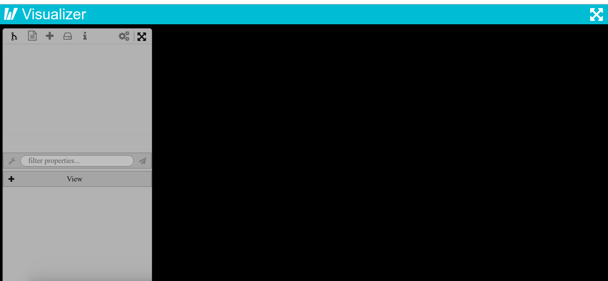

# Paraview Visualizer

For instructions on using the full Paraview Web directly from a Singularity container,
see [this post](https://ask.cyberinfrastructure.org/t/how-do-i-run-paraview-or-openfoam-on-an-hpc-resource/644/2)
on AskCyberinfrastructre. Continue reading below for using the Paraview Visualizer
via a Docker container, or Singularity container instance.

## Singularity
If you don't have nvidia on your host, use the [Singularity](Singularity) recipe. If you have
nvidia, use the [Singularity.nv](Singularity.nv) recipe:

```bash
$ sudo singularity build paraview.simg Singularity     # no nvidia
$ sudo singularity build paraview.simg Singularity.nv  # nvidia
```

If you need it, make a data folder to bind to on the host:

```bash
$ mkdir -p /tmp/data
```
Start the container instance, here we are naming it "visualizer"

```bash
$ singularity instance.start --bind /tmp/data:/data paraview.simg visualizer
```

You should now see the paraview interface running on [127.0.0.1:8080](http://127.0.0.1:8080)



The mapping to `/data` is where local web applications will load files from.

Also note that you *must* stop local web servers, including any Docker applications
running on that port.

# Credits
  Huge thanks to:

  - [@jourdain](https://github.com/jourdain)
  - [@trophime](https://github.com/trophime)


## Interactive shell

If you need to debug interactively:


```bash
$ singularity shell instance://visualizer
```

## Cleaning Up

And to stop the container, you also need sudo

```bash
$ singularity instance.stop instance://visualizer
```

If you are using Singularity 3.0 and up the instance group is now changed 
to "instance stop" and "instance start"
